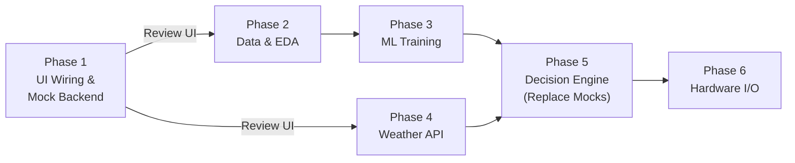

# 🌱 Hydro-Wise — 6-Phase Implementation Plan (UI-First Approach)

> **Strategy**: Build the visible skeleton first — mock endpoints, wired dashboard, full system  
> flow on screen — so that every feature is **seen and understood** before real logic is coded.

---

## Repository Audit Summary

### What Exists (Scaffold Only — Zero Implementation)

| Component | Path | Status |
|---|---|---|
| **ML workspace** | `ml/` | Empty — `data/`, `models/`, `notebooks/` all `.gitkeep` only |
| **API service** | `services/api/` | Bare FastAPI shell — zero routes |
| **Web dashboard** | `apps/web/` | Empty React+Vite shell — renders `<main />` |
| **ESP32 firmware** | `firmware/esp32/` | PlatformIO config only — no source |
| **Data contracts** | `packages/contracts/schemas/` | ✅ 3 JSON schemas defined (sensor, weather, decision) |
| **Docs** | `docs/` | Architecture + implementation sequence documented |

### Tech Stack Already Chosen

| Layer | Technology |
|---|---|
| ML | Python ≥3.11, NumPy, Pandas, Scikit-learn |
| Backend | FastAPI, Pydantic, Uvicorn |
| Frontend | React 19, TypeScript, Vite 6 |
| Firmware | ESP32, PlatformIO, Arduino |
| Monorepo | pnpm workspaces |

---

## Architecture (Never Violate)

```text
                    🌦️ WEATHER API           ← Rule-based gate (NOT an ML input)
                         │
                Rain probability (6 hr)
                         │
              ┌──────────┴──────────┐
              │                     │
            > 30%                 ≤ 30%
              │                     │
              ▼                     ▼
       🚫 DON'T IRRIGATE        🌱 ESP32 SENSOR DATA
                                      │
                          ┌───────────┼───────────┐
                          ▼           ▼           ▼
                     Temperature   Humidity   Soil Moisture
                          └───────────┼───────────┘
                                      ▼
                                🤖 ML MODEL    ← Only 3 features, never rainfall
                                      │
                           ┌──────────┴──────────┐
                           ▼                     ▼
                       IRRIGATE            DON'T IRRIGATE
```

### Hard Constraints

1. Weather API = rule-based first gate, **not** an ML input
2. ML features = **only** `temperature_C`, `humidity_%`, `soil_moisture_%`
3. Rainfall is **never** a training feature
4. Weather gate and ML model = **two separate decision layers**
5. ML output **never** directly controls a pump — safety layer required
6. Synthetic labels must **never** be claimed as real-world observations

---

## Phase 1 — Project Wiring & Dashboard UI (THE PRIORITY)

**Duration estimate**: 5–6 days  
**Depends on**: Nothing (starting point)  
**Objective**: Wire the entire project end-to-end with mock data so every screen, panel, and data flow is **visible and interactive** before any real logic exists

> [!IMPORTANT]
> This is the most important phase. The goal is to **see the whole system working** with  
> fake data so we can validate what features we actually need before writing real ML/API code.

### 1.1 Backend — Mock API Endpoints

Build all FastAPI endpoints with **hardcoded/random mock responses** matching the existing JSON schemas.

| Endpoint | Method | Returns (Mock) | File |
|---|---|---|---|
| `/api/weather/current` | GET | Random rain probability (0–100%), timestamp, `passed` flag | `services/api/app/routes/weather.py` |
| `/api/sensors/latest` | GET | Mock temp/humidity/soil moisture values | `services/api/app/routes/sensors.py` |
| `/api/sensors/reading` | POST | Accepts sensor JSON, stores in-memory, returns 201 | `services/api/app/routes/sensors.py` |
| `/api/sensors/history` | GET | Last 24h of mock sensor readings (generated list) | `services/api/app/routes/sensors.py` |
| `/api/decision/current` | GET | Full mock `IrrigationDecision` with weather gate + ML result + safety status | `services/api/app/routes/decision.py` |
| `/api/decision/history` | GET | Last 24h of mock decisions | `services/api/app/routes/decision.py` |
| `/api/health` | GET | System health check | `services/api/app/routes/health.py` |

Supporting files:

| File | Purpose |
|---|---|
| `services/api/app/config.py` | Env-based configuration loader |
| `services/api/app/models/schemas.py` | Pydantic models matching contract schemas |
| `services/api/app/main.py` | Register all routers, CORS for frontend |
| `services/api/app/mock/data_generator.py` | Mock data generation utilities |

### 1.2 Frontend — Full Dashboard Wireframe

Build the complete dashboard UI with all panels — each panel fetches from the mock API.

#### Main Layout

| Component | What It Shows | File |
|---|---|---|
| **AppShell** | Top nav bar with logo + system status indicator | `apps/web/src/App.tsx` |
| **DashboardPage** | Grid layout holding all panels | `apps/web/src/pages/Dashboard.tsx` |

#### Panel Components (Each is a visual card/widget)

| # | Panel | What the User Sees | Data Source | File |
|---|---|---|---|---|
| 1 | **Decision Hero Card** | Big status: 🟢 IRRIGATE or 🔴 DO NOT IRRIGATE + reason + timestamp | `GET /api/decision/current` | `apps/web/src/components/DecisionCard.tsx` |
| 2 | **Weather Gate Panel** | Rain probability gauge (0–100%), 30% threshold line, pass/fail badge | Same response `.weather_gate` | `apps/web/src/components/WeatherGatePanel.tsx` |
| 3 | **Sensor Readings Panel** | 3 live gauges — Temperature °C, Humidity %, Soil Moisture % | `GET /api/sensors/latest` | `apps/web/src/components/SensorPanel.tsx` |
| 4 | **ML Prediction Panel** | Model output (Irrigate/Don't), model version, "only active when gate passes" note | Same response `.ml_result` | `apps/web/src/components/MLResultPanel.tsx` |
| 5 | **Safety Status Badge** | Current mode: RECOMMENDATION_ONLY / ACTUATION_BLOCKED / ACTUATION_ALLOWED | Same response `.safety_status` | `apps/web/src/components/SafetyBadge.tsx` |
| 6 | **System Flow Diagram** | Visual of Weather Gate → ML → Decision (highlights active path) | Derived from decision | `apps/web/src/components/SystemFlow.tsx` |
| 7 | **Sensor History Chart** | Line chart: temp, humidity, soil moisture over last 24h | `GET /api/sensors/history` | `apps/web/src/components/SensorChart.tsx` |
| 8 | **Decision Log** | Timestamped table of recent decisions with reasons | `GET /api/decision/history` | `apps/web/src/components/DecisionLog.tsx` |

#### UI Infrastructure

| File | Purpose |
|---|---|
| `apps/web/src/api/client.ts` | Typed API client (fetch wrapper) for all endpoints |
| `apps/web/src/hooks/usePolling.ts` | Custom hook to poll endpoints at intervals |
| `apps/web/src/types/index.ts` | TypeScript types matching contract schemas |
| `apps/web/src/styles/global.css` | Base styles, CSS variables, responsive grid |

### 1.3 Frontend–Backend Wiring

| Task | Details |
|---|---|
| Enable CORS on FastAPI for `localhost:5173` (Vite dev) | `services/api/app/main.py` |
| Frontend fetches from `http://localhost:8000/api/*` | `apps/web/src/api/client.ts` |
| Dashboard auto-refreshes decision + sensors every 10 seconds | `apps/web/src/hooks/usePolling.ts` |
| Error states shown in UI when API is down | Each component handles loading/error states |

### 1.4 Sensor Simulator Script

| Task | File |
|---|---|
| Python script that POSTs realistic sensor readings to `/api/sensors/reading` every 5s | `services/api/scripts/simulate_sensor.py` |
| Generates India-climate-realistic values with slight random variation | Same |
| Lets us watch the dashboard update "live" without any hardware | Same |

### Phase 1 — Deliverables

- [ ] All 7 mock API endpoints running on FastAPI
- [ ] Pydantic schemas matching existing JSON contracts
- [ ] Complete React dashboard with 8 visual panels
- [ ] API client + polling hooks
- [ ] CORS wiring — dashboard talks to backend
- [ ] Sensor simulator script for "live" demo
- [ ] Both apps runnable: `pnpm run api:dev` + `pnpm run web:dev`

### Phase 1 — Acceptance Criteria

- [x] Running `api:dev` serves all endpoints with mock data at `localhost:8000`
- [x] Running `web:dev` renders the full dashboard at `localhost:5173`
- [x] Dashboard displays: decision status, weather gate, sensor values, ML result, safety status
- [x] Sensor history chart shows mock time-series data
- [x] Decision log shows mock historical decisions
- [x] System flow diagram highlights whether weather-gate or ML path was taken
- [x] Simulator script makes dashboard values change in real time
- [x] Every panel is visible and understandable — we can evaluate what's needed vs. what's not

> [!TIP]
> After Phase 1, **pause and review the UI together**. Decide which panels to keep, remove,  
> or add before investing in real ML training and API integration.

---

## Phase 2 — Data Preparation & Exploratory Data Analysis

**Duration estimate**: 3–4 days  
**Depends on**: Phase 1 review completed (we know what features matter)  
**Objective**: Create, validate, and explore the 2,000-row synthetic training dataset

### 2.1 Dataset Generation

| Task | File |
|---|---|
| Create reproducible generator script | `ml/scripts/generate_dataset.py` |
| Output 2,000 India-oriented synthetic rows | `ml/data/raw/hydro_wise_dataset.csv` |
| Columns: `temperature_C`, `humidity_%`, `soil_moisture_%`, `irrigation_need_score`, `ml_suggestion` | — |
| Target split: ~40% Irrigate / ~60% Do Not Irrigate | — |
| Labels derived from water-stress heuristics — clearly documented | Script comments |

> [!IMPORTANT]
> No `rain_probability` column. Labels are synthetic — always state this explicitly.

### 2.2 Data Cleaning & Validation

| Task | File |
|---|---|
| Load, inspect dtypes/nulls/duplicates | `ml/notebooks/01_data_preparation.ipynb` |
| Validate ranges (India-realistic temp, 0–100 for humidity/soil) | Same |
| Output cleaned CSV | `ml/data/processed/hydro_wise_clean.csv` |

### 2.3 Exploratory Data Analysis

| Task | File |
|---|---|
| Feature distributions (histograms, box plots) | `ml/notebooks/02_eda.ipynb` |
| Class balance visualization | Same |
| Feature vs. target analysis (violin plots) | Same |
| Correlation heatmap | Same |
| Verify: low soil moisture + high temp + low humidity → Irrigate | Same |

### Phase 2 — Deliverables

- [ ] `ml/scripts/generate_dataset.py`
- [ ] `ml/data/raw/hydro_wise_dataset.csv`
- [ ] `ml/data/processed/hydro_wise_clean.csv`
- [ ] `ml/notebooks/01_data_preparation.ipynb`
- [ ] `ml/notebooks/02_eda.ipynb`

---

## Phase 3 — ML Model Training & Selection

**Duration estimate**: 4–5 days  
**Depends on**: Phase 2 (cleaned dataset)  
**Objective**: Train multiple classifiers, compare rigorously, export best model artifact

### 3.1 Preprocessing

| Task | Details |
|---|---|
| Feature matrix: `[temperature_C, humidity_%, soil_moisture_%]` | 3 features only |
| Target: `ml_suggestion` (binary) | — |
| 80/20 stratified train/test split | — |
| Fit scaler on training set only → save `scaler.pkl` | — |

### 3.2 Train 6+ Classifiers

| # | Model | Rationale |
|---|---|---|
| 1 | Logistic Regression | Interpretable baseline |
| 2 | Decision Tree | Explainable, non-linear |
| 3 | Random Forest | Ensemble, robust |
| 4 | SVM | Strong on small data |
| 5 | KNN | Instance-based |
| 6 | Gradient Boosting | State-of-art tabular |

### 3.3 Evaluate & Compare

| Metric | Method |
|---|---|
| Classification report (precision, recall, F1) | Per model |
| Confusion matrices | Heatmaps |
| 5-fold stratified cross-validation | Primary comparison |
| ROC-AUC curves | All models, one plot |
| Best model selected on **F1-macro** | Not just accuracy |

### 3.4 Export Best Model

| Artifact | File |
|---|---|
| Serialized classifier | `ml/models/best_model.pkl` |
| Serialized scaler | `ml/models/scaler.pkl` |
| Model card (features, metrics, synthetic-label disclaimer) | `ml/models/MODEL_CARD.md` |
| Standalone inference utility | `ml/src/predict.py` |
| Reproducible training CLI script | `ml/scripts/train.py` |

### Phase 3 — Deliverables

- [ ] `ml/notebooks/03_model_training.ipynb`
- [ ] `ml/models/best_model.pkl` + `scaler.pkl`
- [ ] `ml/models/MODEL_CARD.md`
- [ ] `ml/src/predict.py`
- [ ] `ml/scripts/train.py`

---

## Phase 4 — Weather API Integration

**Duration estimate**: 3–4 days  
**Depends on**: Phase 1 (mock endpoint exists, now replace with real)  
**Objective**: Replace mock weather endpoint with a real Weather API and implement the 30% gate

### 4.1 Weather Provider Client

| Task | File |
|---|---|
| Select free API (OpenWeatherMap / Open-Meteo / WeatherAPI) | `docs/weather-provider.md` |
| Async HTTP client fetching 6-hour rain probability | `services/api/app/providers/weather.py` |
| Parse response → `WeatherSnapshot` Pydantic model | Same |
| Error handling: timeout, bad response, API down | Same |
| API key from env (`WEATHER_API_KEY`) | `services/api/app/config.py` |

### 4.2 Weather Gate Logic

| Task | File |
|---|---|
| `rain_probability > 30%` → `DO_NOT_IRRIGATE`, skip ML | `services/api/app/decision/weather_gate.py` |
| `rain_probability ≤ 30%` → `passed = True`, proceed to ML | Same |
| Fail-safe: API unreachable → block irrigation | Same |
| Optional: cache last response with 15-min TTL | Same |

### 4.3 Unit Tests

| Test | File |
|---|---|
| Gate at boundaries: 0%, 29%, 30%, 31%, 100% | `services/api/tests/test_weather_gate.py` |
| API error → fail-safe behavior | Same |

### 4.4 Replace Mock Endpoint

| Task | Details |
|---|---|
| Swap `GET /api/weather/current` from mock → real provider | `services/api/app/routes/weather.py` |
| Dashboard now shows **real** rain probability | No frontend changes needed |

### Phase 4 — Deliverables

- [ ] `services/api/app/providers/weather.py`
- [ ] `services/api/app/decision/weather_gate.py`
- [ ] `services/api/tests/test_weather_gate.py`
- [ ] `docs/weather-provider.md`
- [ ] Real weather data flowing into dashboard

---

## Phase 5 — Decision Engine & Live Integration

**Duration estimate**: 4–5 days  
**Depends on**: Phase 3 (model artifact) + Phase 4 (real weather gate)  
**Objective**: Replace all mock logic with real decision pipeline — weather gate → ML → safety

### 5.1 ML Inference Adapter

| Task | File |
|---|---|
| Load `best_model.pkl` + `scaler.pkl` at startup | `services/api/app/decision/ml_adapter.py` |
| Accept 3 sensor values → return prediction + model version | Same |
| Input validation (range checks) | Same |
| Tests with known inputs | `services/api/tests/test_ml_adapter.py` |

### 5.2 Decision Orchestrator

| Task | File |
|---|---|
| Full flow: weather gate → ML (if passed) → safety layer | `services/api/app/decision/engine.py` |
| Returns `IrrigationDecision` matching contract schema | Same |
| Integration tests | `services/api/tests/test_decision_engine.py` |

### 5.3 Safety Layer

| Task | File |
|---|---|
| Safety statuses: `RECOMMENDATION_ONLY` / `ACTUATION_BLOCKED` / `ACTUATION_ALLOWED` | `services/api/app/decision/safety.py` |
| Default = `RECOMMENDATION_ONLY` until hardware phase | Same |
| ML output is NEVER a direct pump command | Enforced here |

### 5.4 Replace Mock Decision Endpoint

| Task | Details |
|---|---|
| `GET /api/decision/current` now runs real pipeline | No frontend changes needed |
| Dashboard now shows **real** ML predictions + real weather gate | — |

### Phase 5 — Deliverables

- [ ] `services/api/app/decision/ml_adapter.py`
- [ ] `services/api/app/decision/engine.py`
- [ ] `services/api/app/decision/safety.py`
- [ ] `services/api/tests/test_ml_adapter.py`
- [ ] `services/api/tests/test_decision_engine.py`
- [ ] All mock endpoints replaced with real logic

---

## Phase 6 — Hardware Input & Output (ESP32, Sensors, Relay, Pump)

**Duration estimate**: 5–7 days  
**Depends on**: Phase 5 (real backend ready to receive data and return decisions)  
**Objective**: Program ESP32 to read sensors and transmit data; prepare relay/pump actuation

### 6.1 ESP32 Sensor Reading

| Task | File |
|---|---|
| DHT22 pin config (temp + humidity) | `firmware/esp32/src/main.cpp` |
| Soil moisture analog pin config | Same |
| Read + validate all 3 sensors | Same |
| Serial debug output | Same |

### 6.2 Wi-Fi & Data Transmission

| Task | File |
|---|---|
| Wi-Fi connection | `firmware/esp32/src/main.cpp` |
| Credentials config | `firmware/esp32/include/config.h` |
| HTTP POST to `/api/sensors/reading` every 30s | Same |
| Include `device_id`, `captured_at`, auth header | Same |
| Retry on failure, LED status indicator | Same |

### 6.3 Relay & Pump Actuation

| Task | File |
|---|---|
| Relay GPIO config | `firmware/esp32/src/main.cpp` |
| Poll `GET /api/decision/current` | Same |
| Actuate ONLY when `safety_status == ACTUATION_ALLOWED` | Same |
| Manual override button (hardware failsafe) | Same |
| Emergency stop | Same |

> [!CAUTION]
> ESP32 must NEVER make irrigation decisions locally.  
> All decisions come from the server. Relay activates ONLY on `ACTUATION_ALLOWED`.

### 6.4 Hardware Documentation

| Task | File |
|---|---|
| Wiring diagram (sensors, relay, pump) | `docs/hardware-wiring.md` |
| Pin assignment table | Same |
| PlatformIO library dependencies | `firmware/esp32/platformio.ini` (update) |

### Phase 6 — Deliverables

- [ ] `firmware/esp32/src/main.cpp`
- [ ] `firmware/esp32/include/config.h`
- [ ] Updated `firmware/esp32/platformio.ini`
- [ ] `docs/hardware-wiring.md`
- [ ] End-to-end: physical sensor → API → decision → relay

---

## Phase Dependency Map



**Key insight**: After Phase 1, the dashboard is fully visible with mock data. Phases 2–4 work  
**behind the scenes** replacing mocks with real logic — the frontend barely changes because the  
API contracts are already established.

---

## Complete File Map

```text
Hydrowise/
│
├── services/api/                                    ── PHASE 1 (mock) → PHASES 4–5 (real)
│   ├── app/
│   │   ├── main.py                                  ← Phase 1 (CORS + routers)
│   │   ├── config.py                                ← Phase 1 (env config)
│   │   ├── models/
│   │   │   └── schemas.py                           ← Phase 1 (Pydantic models)
│   │   ├── mock/
│   │   │   └── data_generator.py                    ← Phase 1 (mock data utils)
│   │   ├── providers/
│   │   │   └── weather.py                           ← Phase 4 (real weather client)
│   │   ├── decision/
│   │   │   ├── weather_gate.py                      ← Phase 4
│   │   │   ├── ml_adapter.py                        ← Phase 5
│   │   │   ├── engine.py                            ← Phase 5
│   │   │   └── safety.py                            ← Phase 5
│   │   └── routes/
│   │       ├── health.py                            ← Phase 1
│   │       ├── weather.py                           ← Phase 1 (mock) → Phase 4 (real)
│   │       ├── sensors.py                           ← Phase 1 (mock)
│   │       └── decision.py                          ← Phase 1 (mock) → Phase 5 (real)
│   ├── tests/
│   │   ├── test_weather_gate.py                     ← Phase 4
│   │   ├── test_ml_adapter.py                       ← Phase 5
│   │   └── test_decision_engine.py                  ← Phase 5
│   └── scripts/
│       └── simulate_sensor.py                       ← Phase 1
│
├── apps/web/                                        ── PHASE 1 (built once, barely changes)
│   └── src/
│       ├── App.tsx                                  ← Phase 1
│       ├── main.tsx                                 ← Phase 1
│       ├── api/
│       │   └── client.ts                            ← Phase 1 (typed API client)
│       ├── hooks/
│       │   └── usePolling.ts                        ← Phase 1 (auto-refresh)
│       ├── types/
│       │   └── index.ts                             ← Phase 1 (TypeScript types)
│       ├── pages/
│       │   └── Dashboard.tsx                        ← Phase 1
│       ├── components/
│       │   ├── DecisionCard.tsx                     ← Phase 1
│       │   ├── WeatherGatePanel.tsx                 ← Phase 1
│       │   ├── SensorPanel.tsx                      ← Phase 1
│       │   ├── MLResultPanel.tsx                    ← Phase 1
│       │   ├── SafetyBadge.tsx                      ← Phase 1
│       │   ├── SystemFlow.tsx                       ← Phase 1
│       │   ├── SensorChart.tsx                      ← Phase 1
│       │   └── DecisionLog.tsx                      ← Phase 1
│       └── styles/
│           └── global.css                           ← Phase 1
│
├── ml/                                              ── PHASES 2–3
│   ├── data/
│   │   ├── raw/hydro_wise_dataset.csv               ← Phase 2
│   │   └── processed/hydro_wise_clean.csv           ← Phase 2
│   ├── notebooks/
│   │   ├── 01_data_preparation.ipynb                ← Phase 2
│   │   ├── 02_eda.ipynb                             ← Phase 2
│   │   └── 03_model_training.ipynb                  ← Phase 3
│   ├── models/
│   │   ├── best_model.pkl                           ← Phase 3
│   │   ├── scaler.pkl                               ← Phase 3
│   │   └── MODEL_CARD.md                            ← Phase 3
│   ├── src/
│   │   └── predict.py                               ← Phase 3
│   └── scripts/
│       ├── generate_dataset.py                      ← Phase 2
│       └── train.py                                 ← Phase 3
│
├── firmware/esp32/                                  ── PHASE 6
│   ├── src/main.cpp                                 ← Phase 6
│   ├── include/config.h                             ← Phase 6
│   └── platformio.ini                               ← Phase 6 (update)
│
├── docs/
│   ├── architecture.md                              ← existing
│   ├── implementation-sequence.md                   ← existing
│   ├── weather-provider.md                          ← Phase 4
│   └── hardware-wiring.md                           ← Phase 6
│
└── packages/contracts/schemas/                      ← existing (already defined)
    ├── sensor-reading.schema.json
    ├── weather-snapshot.schema.json
    └── irrigation-decision.schema.json
```

---

## Execution Summary

| Phase | Name | What You See After | Real Logic? |
|---|---|---|---|
| **1** | **UI Wiring & Mock Backend** | **Full dashboard with all panels, live-updating with fake data** | ❌ All mock |
| **2** | Data Preparation & EDA | Jupyter notebooks with dataset analysis | ML data only |
| **3** | ML Model Training | Trained model artifact ready to deploy | ML model only |
| **4** | Weather API Integration | Dashboard shows **real** rain probability | Real weather |
| **5** | Decision Engine | Dashboard shows **real** ML predictions + real weather | Everything real |
| **6** | Hardware I/O | Physical sensors feed live data → real decisions → pump | Full system |

> [!TIP]
> **The beauty of this approach**: the frontend is built ONCE in Phase 1 and barely changes.  
> Phases 2–6 progressively swap mock data for real data behind the same API contracts.  
> After Phase 1, you can immediately see and critique every feature.

---

> **This plan is for review only. No code has been implemented.**  
> Approve this plan to begin Phase 1 execution.
